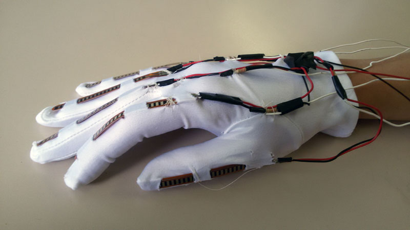

# Glove-FORR3FV

## Hugmynd

Við viljum gera auðvelt og þægilegt viðmót, margar hugmyndir komu upp en við vorum mest spenntir fyrir hanska. Hanskinn á að vera eins lítið áberandi og hægt er, hann á að lesa hreyfingar á puttum og halla. Allar upplýsingar frá skynjurunum sendast beint á Raspberry PI og vinnur svo úr þeim gögnum, t.d. kveikja ljós.

 

## Input
* Flex sensor:
  * Skynjari fyrir hvern fingur, les hvað mikið er búið að beyja fingurinn.
* Gyro:
  * Skynjari sem les halla á allri hendinni.
* Accelerometer:
  * Skynjari sem les hröðun á hendinni.
* Magnetometer:
  * Skynjari sem les í hvaða átt er snúið.

## Output
* Fyrst datt okkur í hug að stjórna fjarstýrðum bíl, en svo fannst okkur við geta tekið þetta lengra. Hanskinn á að geta þjónað sem eðlilegt output tæki, lesa þarf bara hvað notandinn er að gera og Raspberry PI gerir viðeigandi ráðstafanir (keyrir réttann profile eftir því hverju notandinn er að stýra)

## Partar

| PartType               | Partar                                                           | Fjöldi   | Vefslóð                                                                                                                        |
| :----------------------|:-----------------------------------------------------------------|:---------|:-------------------------------------------------------------------------------------------------------------------------------|
| Tölva                  | Nano V3.0 ATmega328P Controller Board for Arduino                | 1        | [Slóð](https://www.gearbest.com/boards-shields/pp_1313295.html?wid=1433363)                                                            |
| Tölva                  | Raspberry Pi 3 - Model B+                                        | 1 (komið)| [Slóð](https://www.modmypi.com/raspberry-pi/raspberry-pi-a-plusb-plus23-1015/rpi3-model-b-plus/raspberry-pi-3-model-b-plus)            |
| Tölva                  | Raspberry Pi Zero                                                | 1        | [Slóð](https://www.modmypi.com/raspberry-pi/raspberry-pi-zero-board-379/rpi-zero-board/raspberry-pi-zero-wireless-pre-soldered-header) |
| Sensor                 | Flex Sensor 2.2"                                                 | 5        | [Slóð](https://www.sparkfun.com/products/10264)                                                                                        |
| Sensor                 | MPU-6050                                                         | 1        | [Slóð](https://www.gearbest.com/sensors/pp_009636731429.html?wid=1433363)                                                              |
| Module                 | DC Motor Driver                                                  | 4        | [Slóð](https://www.gearbest.com/other-accessories/pp_009613984158.html?wid=1433363)                                                    |
| Transmitter / Receiver | NRF24L01+ 2.4GHz Wireless Module                                 | 2        | [Slóð](https://www.gearbest.com/boards-shields/pp_337367.html?wid=1527929)                                                             |
| Transmitter / Receiver | (NRF24L01 + PA + LNA) 1100M Distance Wireless Module with Antenna| 2        | [Slóð](https://www.gearbest.com/transmitters-receivers-module/pp_440447.html?wid=1433363#anchorGoodsReviews)                           |
| Transmitter / Receiver | 5pcs NRF24L01 2.4GHz Wireless                                    | 1        | [Slóð](https://www.gearbest.com/transmitters-receivers-module/pp_009999100621.html?wid=1433363)                                        |
| Battery                | Original Xiaomi ZMI                                              | 2        | [Slóð](https://www.gearbest.com/power-banks/pp_009865650334.html?wid=1433363)                                                          |
| Battery                | Original Xiaomi                                                  | 1        | [Slóð](https://www.gearbest.com/mobile-power-bank/pp_187685.html?wid=1527929)                                                          |
| Sammtals               |                                                                  |          | 19.807 kr-,                                                                                                                              |

## Tengingar

## Höfundar

Pétur Steinn Guðmundsson & Róbert Ingi Hálfdanarson.
